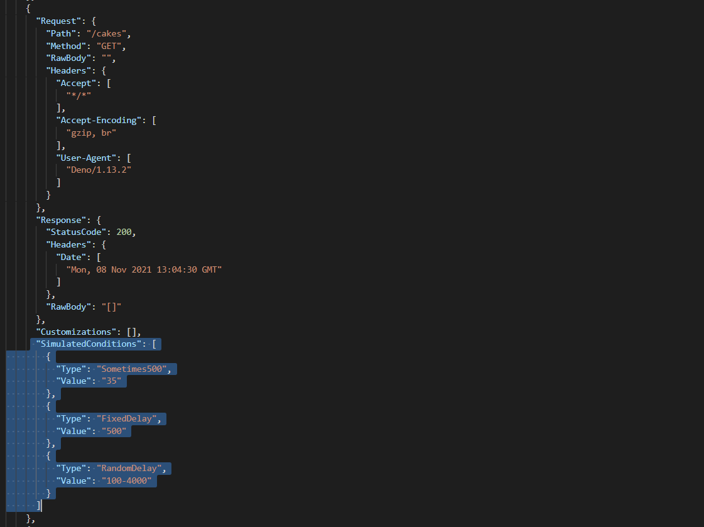

# Rumpel
## Simple, opinionated and automated consumer-driven contract testing for your JSON API's


## Install  

copy+paste one of the following commands in your terminal.

**Linux x64**
```
curl -Lo rumpel https://github.com/hellgrenj/Rumpel/releases/download/v0.4.1/rumpel-linux-x64 && \
sudo install rumpel /usr/local/bin/
```

**macOS x64**
```
curl -Lo rumpel https://github.com/hellgrenj/Rumpel/releases/download/v0.4.1/rumpel-osx-x64 && \
sudo install rumpel /usr/local/bin/
```
**win x64**  
download the [latest exe](https://github.com/hellgrenj/Rumpel/releases/download/v0.4.1/rumpel-win-x64.exe), rename it ``rumpel.exe`` and put it in your PATH. 

**Docker**:   
https://hub.docker.com/r/hellgrenj/rumpel.  


## Use


Record a consumer-driven contract against a known and reproducible state of the API and system under test (SUT). Use the created contract to verify that the API still works for this specific consumer when making changes to the API. Make sure you verify against the same SUT-state as you recorded against.  

You can also use the contract on the consumer side to mock the provider in local development. In this mode Rumpel will validate the consumer requests, making sure that the consumer upholds its end of the contract.  


### tldr
``rumpel --record-contract --target-api=http://localhost:8080 --contract-name=msA-msB``  
``rumpel --verify-contract --contract-path=./contracts/msA-msB.rumpel.contract.json``  
``rumpel --mock-provider --contract-path=./contracts/msA-msB.rumpel.contract.json``  

### examples
Demo application: [artlab](https://github.com/hellgrenj/artlab)  
*a demo of Docker, Kubernetes and Skaffold where Rumpel is used to record a contract and mock a dependency.*

### Rumpel can do **3** things:     
 1. **Record a contract** (i.e turning your implicit contract into an explicit one).   
``rumpel --record-contract --target-api=http://localhost:8080 --contract-name=msA-msB``  
   
Rumpel listens on port 8181 or the number set in the environment variable **RUMPEL_PORT**   
**screenshot**   
  

2. **Verify a contract** (i.e making sure the API still works for a specific consumer)   
``rumpel --verify-contract --contract-path=./contracts/msA-msB.rumpel.contract.json``  
     
Contract verification supports bearer tokens and you can skip certain assertions with   **ignore-flags**.     
Run the --help command for more information.   
This should be a part of the Providers CI/CD pipeline, see ./tests/integration for an example on how to do this with docker-compose.  
**screenshots**  
  
   
**Customizations**  
You can customize the verification per transaction by manually adding Customizations in the contract. In the example below a Customization is added that instructs Rumpel to ignore the object property *name*. A Customization has 3 properties: The name of the target *Object Property*, The name of the *Action* and at what Depth in the JSON the property is found. (is it a first level property or a property in a nested object..)
 
**Available Customizations**  
- CompareObjectPropertyValues *(have Rumpel assert that the value is the same as the recorded value)*  
- IgnoreObjectProperty *(ignores one specific property in the object, i.e allow it to be missing or changed)*  


3. **Mock a provider/API**  
``rumpel --mock-provider --contract-path=./contracts/msA-msB.rumpel.contract.json``   
  
This can be used in local dev environments to mock dependencies, see ./tests/integration for an example of how to do this with docker-compose or the repository [artlab](https://github.com/hellgrenj/artlab) for an example of how to do this with Skaffold.   
Rumpel listens on port 8181 or the number set in the environment variable **RUMPEL_PORT**.    
In this mode Rumpel validates the requests sent by the consumer.  
**screenshot**  
  
**Simulated conditions**  
You can simulate conditions per transaction when mocking a provider by manually adding SimulatedConditions in the contract. Every simulated condition has a *Type* and a *Value*, see the screenshot below for an example. You can add one or several simulated conditions, in the example below we are adding 3 different conditions.  
  
**Available Types of Simulated conditions and the expected Values**  
* *Sometimes500* (Rumpel will have this request fail with status code 500 according to the percentage set as the Value. In the example (screenshot) above the request will fail approximately 35% of the time)  
* *FixedDelay* (Rumpel will add a delay to this request. The Value is the fixed delay in milliseconds)  
* *RandomDelay* (Rumpel will add a random delay between the min and max value provided in the Value property. The min and max values are expected to be provided with the following syntax: minMilliseconds-maxMilliseconds)  
### Rumpel has 5 commands:

``--record-contract`` or the shorthand ``-r``  
``--verify-contract`` or the shorthand ``-v``  
``--mock-provider`` or the shorthand ``-m``  
``--help`` or the shorthand ``-h``  
``--version``   

## Develop 

You need the following installed on your dev machine:  
* dotnet 6.x
* docker 20.10.x
* docker-compose 1.29.x
* deno 1.15.x

### tests
There are both unit tests and integration tests. Check the ./tests folder.    
Run unit tests in ./tests/unit with ``dotnet test``   
Run integration tests in ./tests/integration with ``deno run -A tests.ts``   
Run ALL tests in ./tests with ``deno run -A run_all_tests.ts`` 


